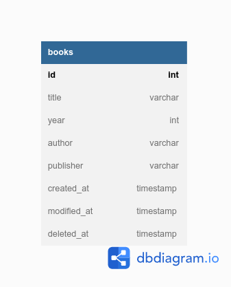

# DTS-PROA-2023-PYT-1-Final-Project

DTS PROA 2023 PYT-1 Final Project Implementasi Python untuk REST API Menggunakan Framework FastAPI
Samuel Christopher Santo

## Tools yang dipakai

1. Python 3.10.6
2. MySQL sebagai database
3. HTML dan CSS (Bootstrap) sebagai tampilan frontend
4. FastAPI sebagai package framework REST API berbasis Python
5. SQLAlchemy sebagai package ORM framework Python untuk database
6. dotenv sebagai package environment variable
7. uvicorn sebagai package ASGI(Asynchronous Server Gateway Interface) web server untuk Python
8. pydantic sebagai package validasi data
9. mysql-connector-python sebagai package untuk konektor Python dengan MySQL

## Package Python yang dipakai

1. fastapi: package FastAPI
2. uvicorn: package uvicorn
3. pydantic: package pydantic
4. sqlalchemy: package SQLAlchemy
5. python-dotenv: package python-dotenv
6. mysql-connector-python: package mysql-connector-python official dari [dev.mysql.com](https://dev.mysql.com/doc/connector-python/en/)

## Development Environment

1. OS: Ubuntu 22.04.2 LTS
2. Code Editor: Visual Studio Code (VSCode)
3. Database: MySQL 10.5.15-MariaDB

## Batasan Fitur

1. REST API dibuat dengan tujuan implementasi sederhana REST API dengan Python menggunakan framework FastAPI
2. REST API hanya mencakup CRUD sederhana untuk database buku dengan field id, title, author, publisher, created_at, updated_at, deleted_at
3. REST API belum menggunakan konsep authentication dan authorization

## Skema Tabel



## Instalasi

1. Python: Download installer Python melalui website [python.org](https://www.python.org/downloads/) berdasarkan OS yang digunakan
2. MySQL: bisa menggunakan XAMPP untuk OS Windows atau instalasi via command prompt untuk OS Linux
3. VSCode: download installer VSCode melalui website [code.visualstudio.com/](https://code.visualstudio.com/) berdasarkan OS yang digunakan
4. Package yang dipakai: `pip install "fastapi[full] pydantic sqlalchemy python-dotenv mysql-connector-python"`

## Format file .env

1. File `.env` akan digunakan sebagai environment variable untuk memudahkan penggunaan project. Pada project ini digunakan sebagai penyimpan variable untuk koneksi ke database
2. Isi file `.env` adalah sebagai berikut.
   ```
    host=[nama host database yang digunakan, misal localhost]
    port=3306
    username=[username database yang digunakan, misal root]
    password=[password database yang digunakan, misal kosong untuk XAMPP]
    database=[nama database yang digunakan, contoh disini adalah python_mysql]
   ```
3. Ganti semua yang dalam kurung kotak menyesuaikan dengan environment masing-masing.
4. Taruh file `.env` ke root project.

## Cara penggunaan (setelah instalasi)

1. Clone atau download dari [repositori berikut](https://github.com/samuelchristopher/DTS-PROA-2023-PYT-1-Final-Project)
2. Buka terminal untuk Linux & MacOS atau CMD untuk Windows dan masuk ke dalam clone repositori tersebut
3. Masuk ke dalam MySQL melalui XAMPP di OS Windows atau melalui terminal dengan command `mysql -u [username] -p` jika menggunakan password atau `mysql -u [username]` jika tanpa password di OS Linux dan MacOS
4. Setelah berhasil masuk ke MySQL, buat database , contoh `python_mysql` yang akan digunakan untuk project ini.
5. Selesai membuat database, buka terminal baru dan jalankan command `uvicorn main:app` untuk menjalankan web server Python. Jika terjadi kendala, pastikan kembali file `.env` sesuai format.
6. Terkait tabel MySQL, setelah menjalankan command `uvicorn main:app`, table akan terbentuk sendiri.
7. REST API siap digunakan

## Endpoint REST API

| Endpoint   | Method | Purpose           |
| ---------- | ------ | ----------------- |
| /books     | POST   | Insert New Book   |
| /books     | GET    | Get All Books     |
| /books/:id | GET    | Get Book By ID    |
| /books/:id | PUT    | Update Book By ID |
| /books/:id | DELETE | Delete Book By ID |

## Format JSON

```
{
  "title":"string",
  "year":"integer",
  "author":"string",
  "publisher":"string"
}
```
